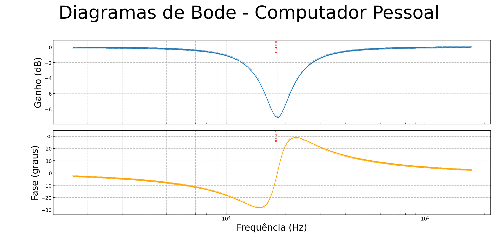

# Common Issues in the Rigol DHO914S Bode Plot Function and Effective Solutions
This repository aims to describe and implement Standard Commands for Programmable Instruments (SCPI) communication over the Universal Serial Bus (USB) with the Rigol DHO914S oscilloscope to acquire low-noise, high-resolution Bode diagrams for the analysis of signals and systems.

The Rigol DHO914S is a 12-bit digital oscilloscope with a maximum analog bandwidth of 125 MHz and four analog input channels. It features a real-time sampling rate of up to 1.25 GSa/s and a memory depth of 50 Mpts. The device integrates several advanced functions, including an arbitrary function generator (AFG), Bode plot analysis, histogram measurements, digital signal analysis, and more.

One of the problems encountered was related to the Bode plot diagram. The oscilloscope itself includes a built-in Bode plot function. However, when analyzing the plotted results, small undulations — resembling ripples or fringes — were observed in both the gain (dB) and the phase (°) curves.

As observed in the figure above, both the gain (dB) and the phase (°) exhibit small ripples — slight undulations superimposed on the expected curves. We acquired the signal multiple times, initially suspecting random white noise as the source. However, the consistent presence of these ripples across measurements suggests that they are not random in nature.

One possible source of this behavior is the internal method used by the oscilloscope to calculate gain and phase between the two signals. Potential contributors include FFT leakage, windowing effects, or even the internal arithmetic processing. The Rigol DHO914S is based on Field Programmable Gate Arrays (FPGAs) and Digital Signal Processors (DSPs), which are responsible for performing these mathematical operations. These hardware components typically use fixed-point arithmetic with limited precision instead of high-precision floating-point arithmetic (such as IEEE 754 double precision, float64).

Considering everything analyzed so far, I used Python, USB, and SCPI commands to establish communication with the oscilloscope through a more modular script. This allowed me to acquire both the input and output waveforms of the system under study. With these signals in hand, I implemented methods to calculate the gain (dB) and phase (°) plots.

As shown above, the image was taken using my personal computer with the same data. We can clearly see the the differences between both. It doesn't seem to be influenced by system response,  considering those resembling ripples are persistent.

According to Analog Devices article (2015), "with fixed-point notation, the gaps between adjacent numbers always equal a value of one, whereas in floating-point notation, gaps between adjacent numbers are not uniformly spaced – the gap between any two numbers is approximately ten million times smaller than the value of the numbers (ANSI/IEEE Std. 754 standard format), with large gaps between large numbers and small gaps between small numbers." It could explain

## OBS.: Files here are still a prototype.
